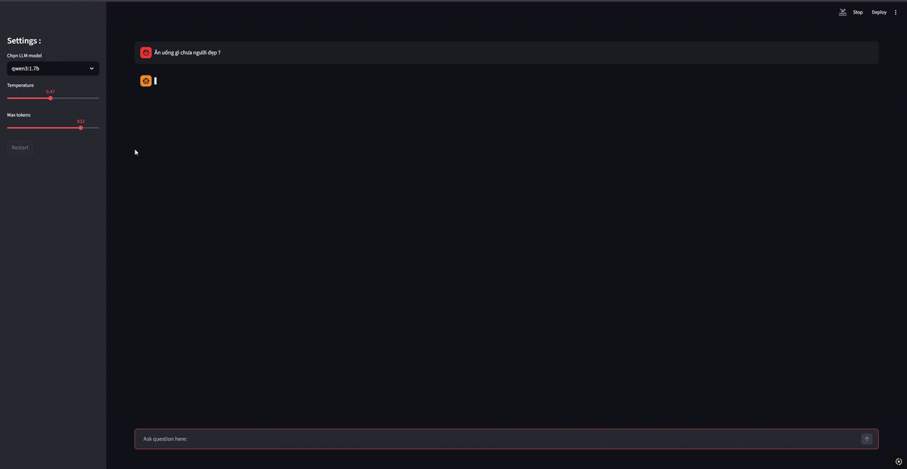
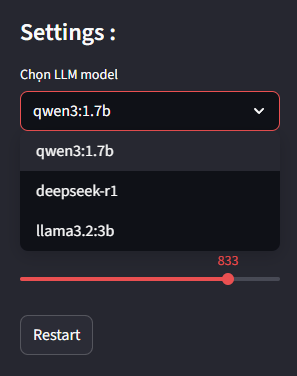

# RAG Vietnamese QA Chatbot

[](https://www.python.org/)
[](https://ollama.com/)
[](https://opensource.org/licenses/MIT)

A local RAG (Retrieval-Augmented Generation) chatbot built with **Ollama** + **ChromaDB** that answers questions based on the Vietnamese QA ver2 dataset (from Kaggle).

In purposes of learning RAG pipelines, local LLM inference, and Vietnamese NLP.

## Demo



## Select-box for changing Model



## Features

- Full RAG pipeline: Load dataset -> Chunking -> Embedding -> Store in ChromaDB -> Retrieve -> Chain -> Generate
- Good handling of paraphrase / similar questions (via prompt engineering)
- Embedding with `qwen3-embedding:0.6b`
- Using `"qwen3:1.7b", "deepseek-r1", "llama3.2:3b"` for LLM inferences
- Using `Streamlit` for Web-UI

## Tech Stack

- **Language**: Python 3.10+
- **Text splitting**: LangChain
- **Data processing**: pandas, kagglehub
- **Vector Database**: ChromaDB (persistent)
- **LLM & Embedding**: Ollama (local inference)

## Installation

1.  Clone the repository:

    ```bash
    git clone https://github.com/ikruL/rag-vietnamese-qa.git

    cd rag-vietnamese-qa
    ```

2.  Create and activate virtual environment:

    ```bash
    python -m venv .venv

    .venv\Scripts\activate
    ```

3.  Install dependencies:
    ```bash
    pip install -r requirements.txt
    ```
4.  Install Ollama & pull models:
    - Download Ollama: https://ollama.com/download
    - Pull embedding & LLM models:

      ```bash
      ollama pull qwen3-embedding:0.6b

      ollama pull qwen3:1.7b

      ollama pull deepseek-r1

      ollama pull llama3.2:3b

      ollama serve
      ```

5.  Run the chatbot with Streamlit:
    ```bash
    streamlit run app.py
    ```
